```mermaid
%%{init: {'theme': 'base', 'themeVariables': { 'primaryColor': '#007acc', 'edgeLabelBackground':'#ffffff', 'tertiaryColor': '#f4f4f4'}}}%%
flowchart LR
    %% Data Source & Trigger
    subgraph Data_Layer [Input & Trigger]
        A[(Google Sheet<br/>New Lead)]
        B{Apps Script<br/>Trigger}
    end

    %% Backend Engine
    subgraph Engine [FastAPI Backend]
        C[API Endpoint<br/>POST /run-agent]
    end

    %% The Intelligent Agent Logic
    subgraph Agentic_Workflow [LangGraph Orchestration]
        D[[Agent Manager]]
        E[Planner Node]
        F[Tavily Search]
        G{Evaluator}
        H[RAG Retriever]
        I[Email Writer]
        J{Validator}
    end

    %% Persistence & Outputs
    subgraph Persistence_Layer [Outputs]
        K[State Saver]
        L[(Google Sheets<br/>Audit Log)]
        M[Gmail Drafts<br/>Human-in-the-Loop]
    end

    %% Connections
    A -->|Status: NEW| B
    B --> C
    C --> D
    D --> E
    E --> F
    F --> G
    G -->|Insufficient| F
    G -->|Sufficient| H
    H --> I
    I --> J
    J -->|Retry| I
    J -->|Approved| K
    K --> L
    K --> M

    %% Node Styling
    style A fill:#e1f5fe,stroke:#01579b
    style K fill:#e8f5e9,stroke:#2e7d32
    style L fill:#e1f5fe,stroke:#01579b
    style M fill:#fff3e0,stroke:#e65100
    style J fill:#fce4ec,stroke:#c2185b
    style G fill:#fce4ec,stroke:#c2185b
    style D font-weight:bold,stroke-width:2px
```

# Auto-SDR Agent

**AI Agent for Lead Research & Personalized Outreach**

An autonomous AI system that monitors new leads, researches companies using live web data, and generates personalized outreach emails — all while keeping a human in the loop.

---

## 🚩 Problem

Sales teams spend significant time on:

- Manual company research
- Writing personalized cold emails
- Maintaining consistency at scale

This process is slow, error-prone, and difficult to scale as lead volume increases.

---

## ✅ Solution

The **Auto-SDR Agent** automates the research and drafting steps while keeping full human control over sending emails.

**What it does:**

- Monitors a Google Sheet for new leads
- Researches each company using live web data
- Applies predefined ICP and tone rules
- Generates a personalized outreach email
- Saves results to Google Sheets
- Creates a Gmail draft for human review

**What it does NOT do:**

- It does not send emails automatically
- It does not replace human judgment
- It does not promise guaranteed conversions

---

## 🧠 Key Concepts Used

- **Agentic AI:** Decision-making, looping, and tool usage
- **LangGraph:** Controlled execution flow for the agent
- **RAG (Retrieval-Augmented Generation):** Enforces client-specific rules and tone
- **Live Web Research:** Prevents hallucinations and generic messaging
- **Human-in-the-loop:** Drafts are reviewed before sending

---

## 🔁 End-to-End Workflow



---

## 🛠 Tech Stack

### Core

- Python
- FastAPI
- LangGraph
- Pydantic

### AI & Research

- OpenAI / Google AI Studio (pluggable)
- Tavily Web Search

### Integrations

- Google Sheets API
- Google Apps Script
- Gmail API (drafts only)

### Infra & Demo

- ngrok (local webhook exposure)
- Uvicorn

---

## 📁 Project Structure

```
ai-sdr-agent/
├── agent/
│   ├── graph.py
│   ├── planner.py
│   ├── evaluator.py
│   └── validator.py
├── tools/
│   ├── tavily_search.py
│   ├── email_writer.py
│   ├── sheets_tool.py
│   ├── gmail_tool.py
│   └── persist_node.py
├── api.py
├── requirements.txt
├── .env.example
└── README.md
```

---

## ⚙️ How It Works (High Level)

1. A new lead is added to Google Sheets with status `NEW`
2. Apps Script triggers the backend via HTTP
3. The agent:
   - Plans research
   - Fetches live company data
   - Evaluates data quality
   - Applies RAG rules
   - Generates a personalized email

4. Output is logged to Google Sheets
5. A Gmail draft is created for review

---

## 🔐 Safety & Control

- No automatic email sending
- Full visibility in Google Sheets
- Human approval required before outreach
- No scraping private data

---

## 🎯 Use Cases

- B2B SaaS outbound teams
- Agencies doing lead generation
- Consultants running targeted outreach
- Internal SDR tooling

---

## 📌 Notes

This project is designed as a **portfolio-ready demonstration** of agentic AI applied to a real business workflow.
It can be extended with CRM integrations, follow-ups, or deployment to cloud infrastructure.

---

## 📬 Contact

If you’re interested in adapting a similar system for your business or workflow, feel free to reach out.

```

```
